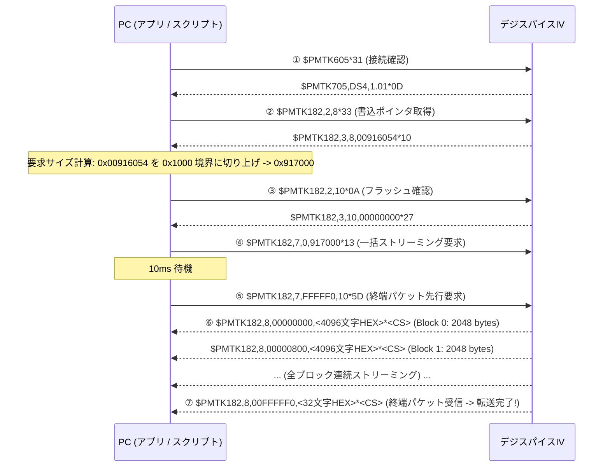

# デジスパイスIV (DigSpice IV) 非公式 制御＆ログ吸い出しツール (`ds_universal`)

**Mac / Windows 両対応！公式アプリなしで直接USB通信・設定変更・ログダウンロードが可能なマルチプラットフォームツール**


---

## 🏎️ 本プロジェクトについて

モータースポーツ・サーキット走行用の超小型高精度GPSロガー **「デジスパイスIV（DigSpice IV）」** は、20Hz測位に対応した日本のサーキットユーザー定番のデータロガーです。

しかし、公式ソフトウェアがWindows専用であるため、
- 「サーキットにMacBookを持っていってもログが吸い出せない」
- 「公式アプリを起動せずにサクッと設定（20Hzへの変更や開始速度の変更）を行いたい」
- 「自作スクリプトやコマンドラインから自動でログを吸い出し、公式分析ソフトでも開ける形式で保存したい」

といった要望に応えるため、本プロジェクト `ds_universal` を開発しました。

本ツールで吸い出した `.bnx4` ファイルは、**公式デジスパイス分析ソフトでそのまま開いて走行軌跡・車速比較・ラップタイム解析を行えます**（公式アプリ独自の後処理メタデータを完全再現して出力します）。

---

## ✨ 主な機能

1. **Mac / Windows 両対応の Electron デスクトップGUIアプリ**
   - サーキット現場でMacBookからワンクリックで接続・ログダウンロード・設定変更。
   - Chromium標準の **Web Serial API** を採用しているため、ネイティブモジュールのビルド（`node-gyp` 等）が一切不要。
2. **Windows PowerShell CLI ツール (`digspice_cli.ps1`)**
   - コマンドラインから自動化スクリプト等に組み込み可能。
   - ハードウェアID（VID: `0x2DCF`, PID: `0x6002`）による **COMポート完全自動検出**。
3. **現在の設定・状態の確認 (`GetConfig`)**
   - ファームウェアバージョン（DS4 v1.01等）
   - 現在のログ書き込みポインタ・保存済みログ容量（バイト数）
   - 測位レート（20 Hz / 10 Hz / 5 Hz）
   - ログ記録開始・停止速度（30 km/h 等）
   - バッテリー・内部ステータスコード
4. **測位・ログ記録レート変更 (`SetRate`)**
   - `20 Hz` (50ms周期、最高精度) / `10 Hz` / `5 Hz` へのワンクリック切り替え
5. **走行ログ自動記録 開始/停止 速度閾値の設定 (`SetSpeed`)**
   - 時速 10 km/h, 20 km/h, 30 km/h, 35 km/h などの閾値を自由に変更
6. **本体走行ログの高速ダウンロード (`Download`)**
   - 内蔵フラッシュメモリから一括ストリーミング転送で高速ダウンロード。
   - 公式ソフトと100%互換の `.bnx4` 形式として自動保存（初期ファイル名: `DS4_YYYYMMDDHHMM.bnx4`）。
7. **本体ログの全消去 (`Erase`)**
   - 次回走行に備えたフラッシュメモリ全消去（誤消去防止の確認ロック付き）。
8. **リアルタイム通信パケットログ表示**
   - デバイスとの送受信（NMEAテキスト・HEX）をリアルタイムにモニタリング可能。

---

## 📁 ファイル構成

```text
ds_universal/
├── README.md               # 本ドキュメント（使い方・通信プロトコル仕様書）
├── protocol_analysis.md    # プロトコル詳細技術資料
├── digspice_cli.ps1        # Windows用 PowerShell CLI スクリプト
├── package.json            # Electron アプリ設定
├── main.js                 # Electron メインプロセス (自動ポート選択 & ファイル保存)
├── preload.js              # セキュア IPC ブリッジ
├── index.html              # GUI レイアウト
├── styles.css              # GUI スタイル (ダークテーマ)
├── renderer.js             # Web Serial 通信・プロトコル制御ロジック
└── .gitignore              # 除外設定
```

---

## 💻 使い方 1: Electron GUI アプリ (Mac / Windows 共通)

### 準備
Node.js (v18以降) がインストールされている環境で実行します。

```bash
# 1. 依存パッケージのインストール（初回のみ）
npm install

# 2. アプリの起動
npm start
```

### 操作手順
1. デジスパイスIVを付属USBケーブルでPCに接続し、電源を入れます。
2. 画面右上の **「🔌 デバイスに接続」** をクリックします（自動でデジスパイスIVが選択されます）。
3. 接続後、ファームウェアバージョン、記録容量、設定レートが自動表示されます。
4. **「📥 ログデータをダウンロード」** を押すと、高速ストリーミングでデータを吸い出し、`DS4_YYYYMMDDHHMM.bnx4` として保存されます。

---

## 📟 使い方 2: Windows PowerShell CLI (`digspice_cli.ps1`)

COMポート番号の指定は不要です。自動でデジスパイスIVを検出します。

```powershell
# ① 現在の設定・ログ保存容量を確認
.\digspice_cli.ps1 -Command GetConfig

# ② ログレートを 20 Hz に変更
.\digspice_cli.ps1 -Command SetRate -Rate 20

# ③ ログ開始速度を 30 km/h に設定
.\digspice_cli.ps1 -Command SetSpeed -Speed 30

# ④ ログデータを吸い出してファイルに保存 (初期値: DS4_YYYYMMDDHHMM.bnx4)
.\digspice_cli.ps1 -Command Download

# ⑤ 保存先ファイル名を指定してダウンロード
.\digspice_cli.ps1 -Command Download -OutputFile my_track_data.bnx4

# ⑥ 本体の全ログを消去 (誤消去防止のため -Force が必須)
.\digspice_cli.ps1 -Command Erase -Force
```

---

# 📖 デジスパイスIV USB通信プロトコル仕様書

本セクションの仕様を参照することで、任意の言語（Python, C#, Rust, Go等）でデジスパイスIVの通信制御およびログダウンロード処理を完全に再現・実装できます。

## 1. 物理層・シリアルパラメータ

| 項目 | 仕様 |
| :--- | :--- |
| **USB Device Class** | USB CDC-ACM (仮想COMポート) |
| **USB Vendor ID (VID)** | `0x2DCF` |
| **USB Product ID (PID)** | `0x6002` |
| **Baud Rate** | **115200 bps** |
| **Data Bits** | 8 |
| **Parity** | None |
| **Stop Bits** | 1 (8N1) |
| **Flow Control** | なし（DTR=True, RTS=True でオープン） |

## 2. パケットフォーマット・チェックサム

すべてのコマンドおよびレスポンスは、**NMEA-0183 準拠のASCII文字列** です。

```text
$<Body>*<Checksum>\r\n
```

- **改行コード**: `<CR><LF>` (`\r\n`, `0x0D 0x0A`)
- **チェックサム計算**:
  `$` の直後から `*` の直前までの全文字の **XOR（排他的論理和）** を計算し、2文字の大文字16進数（Hexadecimal uppercase: `00`〜`FF`）で付加します。
  - 例: `$PMTK605` のチェックサム: `'P' ^ 'M' ^ 'T' ^ 'K' ^ '6' ^ '0' ^ '5'` = `0x31` $\rightarrow$ `$PMTK605*31\r\n`

## 3. コマンド・レスポンス一覧

### 3.1 デバイス情報・ステータス

| 機能 | ホスト送信コマンド | デバイス応答 | 備考 |
| :--- | :--- | :--- | :--- |
| **ファームウェア確認** | `$PMTK605*31` | `$PMTK705,DS4,1.01*0D` | モデル名(`DS4`)、バージョン(`1.01`) |
| **次回書込ポインタ取得** | `$PMTK182,2,8*33` | `$PMTK182,3,8,<Address8>*<CS>`<br>`$PMTK001,182,2,3*25` | 16進8桁。消去直後は `00000200` |
| **フラッシュ状態確認** | `$PMTK182,2,10*0A` | `$PMTK182,3,10,00000000*27`<br>`$PMTK001,182,2,3*25` | 正常時は `00000000` |
| **内部ステータス取得** | `$PTSI990,2,0*2C` | `$PTSI990,2,0,27*05` | `27` はバッテリー/電圧ステータス |

### 3.2 測位レート設定・確認

| 機能 | ホスト送信コマンド | デバイス応答 | 備考 |
| :--- | :--- | :--- | :--- |
| **20 Hz 設定 (最高精度)** | `$PMTK300,50,0,0,0,0*18` | `$PMTK001,300,3*33` | 周期 50 ms (20回/秒) |
| **10 Hz 設定** | `$PMTK300,100,0,0,0,0*1C`| `$PMTK001,300,3*33` | 周期 100 ms (10回/秒) |
| **5 Hz 設定** | `$PMTK300,200,0,0,0,0*1F`| `$PMTK001,300,3*33` | 周期 200 ms (5回/秒) |
| **現在の動作レート確認** | `$PMTK400*36` | `$PMTK500,<Interval>,0,0,0.0,0.0*<CS>` | 現在の実測周期（50, 100, 200等）が返る |

### 3.3 走行記録 開始/停止 速度閾値

| 機能 | ホスト送信コマンド | デバイス応答 | 備考 |
| :--- | :--- | :--- | :--- |
| **速度閾値の確認** | `$PTSI777,1*34` | `$PTSI777,0,<Speed>.00*<CS>` | 例: `$PTSI777,0,30.00*34` (30 km/h) |
| **速度閾値の設定** | `$PTSI777,2,<Speed>.00*<CS>` | `$PTSI777,0,<Speed>.00*<CS>` | 例: `$PTSI777,2,30.00*36` |

### 3.4 ログフラッシュ全消去 (Erase)

| 機能 | ホスト送信コマンド | デバイス応答 |
| :--- | :--- | :--- |
| **ログ全消去** | `$PMTK182,6,1*3E` | `$PMTK001,182,6,3*21` |

※ 消去完了後、`$PMTK182,2,8` を送ると書き込みポインタがベースアドレス `00000200`（ログ容量 0 バイト）に初期化されます。

---

## 4. ログデータ・ダウンロードプロトコル

### 4.1 ダウンロードシーケンス

ログデータは小刻みに分割要求するのではなく、**一括ストリーミング読み出しコマンドを 1 回送信し、デバイスから全ブロックを連続受信する**設計になっています。



### 4.2 要求サイズの計算規則
- アドレス `wp` を取得後、セクタ境界（`0x1000` = 4096 バイト）に切り上げます：
  $$\text{reqSize} = (wp + \text{0x0FFF}) \ \& \ \sim\text{0x0FFF}$$
  （最低 `0x1000` バイトを保証）
- 例: $wp = \text{0x00916054}$ の場合、$\text{reqSize} = \text{0x917000}$

### 4.3 ストリーミング受信パケットの構造
各データブロックは以下の形式で送られてきます：
```text
$PMTK182,8,<Address8>,<HexData4096>*<Checksum>\r\n
```
- `<Address8>`: データの先頭アドレス（16進数8桁、`00000000`, `00000800`, `00001000`, ...）
- `<HexData4096>`: **2048 バイト** のバイナリデータ（16進数 4096 文字、大文字）
- **受信処理**: 2文字ずつバイト値（`0x00`〜`0xFF`）にデコードしてバイナリバッファに追記します。
- **転送完了の判定**: `<Address8>` が `00FFFFF0` のパケットを受信した瞬間にストリーミングを完了・終了します。

---

## 5. バイナリログフォーマットとレコード構造

受信したバイナリバッファは、フラッシュメモリの生データ構造を保持しています。

### 5.1 全体構造
- **セクタサイズ**: 4096 バイト（`0x1000`）
- **ヘッダ領域**: 各セクタの先頭 `0x0000` 〜 `0x01FF`（512 バイト）
  - オフセット `0x0002` 〜 `0x0005`: ログ記録マスク（`0x0004103F`）
- **走行ログデータ領域**: 各セクタの `0x0200` 〜 `0x0FFF`（3584 バイト）
  - 各セクタの先頭付近にプリアンブルタグ（`AA AA AA AA AA AA AA` ... `BB BB BB BB` の 16 バイト）が含まれる場合があり、これはスキップします。
  - 末尾の未記録領域は `0xFF` で埋められています。

### 5.2 36バイト GPS レコードレイアウト
デジスパイスIVの走行ログレコードは **36 バイト固定長** です。

| オフセット | サイズ | 型 | 項目名 | 内容・単位 |
| :--- | :--- | :--- | :--- | :--- |
| `0x00` | 4 B | `uint32` (LE) | **UTC Timestamp** | UNIXエポック秒（UTC日時） |
| `0x04` | 2 B | `uint16` (LE) | **Fix Mode** | 測位状態（`3` = 3D Fix, 有効測位） |
| `0x06` | 8 B | `double` (LE) | **Latitude** | 緯度（度、64-bit IEEE 754 浮動小数点数） |
| `0x0E` | 8 B | `double` (LE) | **Longitude** | 経度（度、64-bit IEEE 754 浮動小数点数） |
| `0x16` | 4 B | `float` (LE) | **Altitude** | 標高（メートル、32-bit IEEE 754 浮動小数点数） |
| `0x1A` | 4 B | `float` (LE) | **Speed** | 車速（km/h、32-bit IEEE 754 浮動小数点数） |
| `0x1E` | 2 B | `uint16` (LE) | **Heading** | 方位角（進行方向、0.01度単位） |
| `0x20` | 2 B | `uint16` (LE) | **Reserved** | 予約領域 |
| `0x22` | 2 B | `uint16` (LE) | **Checksum/Status** | レコードステータス |

---

## 6. 公式分析ソフト互換メタデータ仕様 (.bnx4 認証ヘッダ)

公式分析ソフト（`DigSpice.exe`）で `.bnx4` ファイルを開く際、ファイル先頭ヘッダの特定オフセットに**後処理メタデータ**が書き込まれていないと、「ログがデジスパイスの形式ではありません。」と表示されてファイルを開くことができません。

本体からダウンロードした直後の生データでは、この領域は未記録（`FF FF FF FF FF FF FF FF FF FF`）のままです。ファイル保存時に以下の計算を行い、ヘッダに書き込みます。

### 6.1 メタデータの配置
- **格納オフセット**: `0x00000100` 〜 `0x00000109`（10 バイト）
- **データ型**: x87 FPU / Delphi **`Extended`** 型（80-bit IEEE 754 拡張倍精度浮動小数点数、リトルエンディアン）

### 6.2 メタデータ算出式

$$\text{meta} = \sqrt{N} + (\pi \times \text{lat}_0) + \left(\frac{\text{lon}_0}{\pi}\right)$$

| 変数 | 定義 |
| :--- | :--- |
| **$\pi$** | Delphi 内蔵 80-bit 円周率定数 $\approx 3.1415926535897932385$（仮数部 `0xc90fdaa22168c235`） |
| **$\text{lat}_0$** | ログ全体の中で最初に記録された有効測位レコード（3D Fix）の**緯度**（Double, 度） |
| **$\text{lon}_0$** | ログ全体の中で最初に記録された有効測位レコード（3D Fix）の**経度**（Double, 度） |
| **$N$** | ログ全体に含まれる**有効な走行レコードの総数**（3D Fix かつ `speed > 0.0` のレコード件数） |

### 6.3 公式ソフトの検証条件
公式ソフトはファイル読み込み時に全セクタをパースして期待値 $\text{calc}$ を再計算し、オフセット `0x0100` に記録された値 $\text{file}$ と比較します：

$$|\text{calc} - \text{file}| \le 0.1$$

誤差が許容値 `0.1` 以内であれば正常にファイルが読み込まれます。

### 6.4 80-bit Extended へのエンコード仕様
算出した `meta` 値（浮動小数点数）を、10 バイトのリトルエンディアンバイト列にエンコードします：
- **バイト 0〜7**: 64 ビット仮数部（整数ビット 1 を含む陽の正規化仮数、`round(m * 2^63)`）
- **バイト 8〜9**: 15 ビットバイアス付き指数部（バイアス `16383` = `0x3FFF`）および符号ビット

### 6.5 保存ファイル名の命名規則
公式分析ソフトに完全準拠し、ダウンロードを実行したPCの現在時刻（ローカル時間）を使用して生成します：
```text
DS4_YYYYMMDDHHMM.bnx4
```
（例: 2026年10月2日 16時27分に保存した場合 $\rightarrow$ `DS4_202610021627.bnx4`）

---

## ⚠️ 免責事項

- 本ツールおよび本ドキュメントは有志による非公式の成果物であり、デジスパイス製造元（株式会社デジスパイス）とは一切関係ありません。
- 本ツールの利用により生じた機器の故障、データの破損、その他いかなる損害についても開発者は責任を負いかねます。自己責任にてご使用ください。
- ログ消去（`Erase`）を実行する際は、事前に必要なデータが保存されていることを必ずご確認ください。
