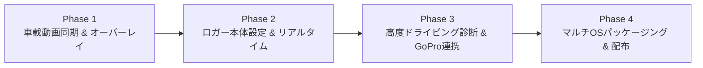

# DigiSpice Universal Suite - 開発ロードマップ & 今後の TODO

本プロジェクトの今後の機能拡張・実装タスク一覧です。公式解析ソフト（`DigSpice.exe`）の全機能網羅に加え、現代的なモータースポーツ解析スイートとしての独自強化項目を定義しています。

---

## 📌 優先度別ロードマップ

---

## 🎥 Phase 1: 車載動画（オンボード映像）同期 & テレメトリオーバーレイ再生 【最優先】

公式解析ソフトの重要機能であり、走行ログと実際のドライバー視線・ステアリング操作・挙動を視覚的に突き合わせるためのコア機能。

- [ ] **1.1 動画プレイヤーコンポーネントの実装 (`VideoSyncWindow.tsx`)**
  - [ ] ローカル動画ファイル (`.mp4`, `.mov`, `.webm`) のドラッグ＆ドロップ読込
  - [ ] HTML5 `<video>` 要素を用いた低遅延再生コントロール（再生、一時停止、コマ送り、コマ戻し、0.25x〜2.0x 倍速再生）
  - [ ] フルスクリーン表示 / ピクチャ・イン・ピクチャ (PiP) 表示対応
- [ ] **1.2 GPS 走行ログと動画のタイムライン同期エンジン**
  - [ ] コントロールライン（スタート/フィニッシュライン）通過シーンによるワンクリック同期ポイント設定
  - [ ] 特定コーナー進入やパイロン通過などの任意フレームによるマニュアル微調整（±0.05秒単位）
  - [ ] シークバー操作・グラフクリック時の動画現在時刻への完全同期
  - [ ] 動画シーク時のマップ（車両アイコン・走行ライン）および速度・Gグラフのリアルタイム追従
- [ ] **1.3 リアルタイム・テレメトリオーバーレイ描画**
  - [ ] 動画上に Canvas で計器類を透過オーバーレイ合成
  - [ ] デジタルスピードメーター（km/h, 色付きバーメーター）
  - [ ] Gフォースメーター（前後G・横Gのインジケーター & フリクションサークル）
  - [ ] ラップタイム・リアルタイムセクター差分（デルタタイム：ベスト対比 ±秒）表示
  - [ ] ギア段数推定 / スロットル・ブレーキ簡易インジケーター（加減速G連動）
- [ ] **1.4 （発展）テレメトリ合成動画のエクスポート**
  - [ ] WebCodecs / WebAssembly 版 FFmpeg (`@ffmpeg/ffmpeg`) を用いた動画レンダリング
  - [ ] メーターが焼き込まれた YouTube / SNS 共有用 MP4 動画のローカル書き出し

---

## ⚙️ Phase 2: ロガー本体（DigSpice IV）設定変更 & リアルタイムモニター

USB シリアル通信をさらに拡張し、公式アプリを使わずにロガーのすべての動作設定をコントロール可能にする。

- [ ] **2.1 ロガー本体設定の書き込み（NMEA コマンド送信）**
  - [ ] **サンプリングレート設定**: 10Hz（標準） $\leftrightarrow$ 20Hz（デジスパイスIV 高密度）の切り替え
  - [ ] **ログ記録開始速度（Auto Log Speed）設定**: 10km/h / 20km/h / 30km/h などの自動記録開始閾値変更
  - [ ] **衛星受信モード設定**: GPS + GLONASS + QZSS（みちびき）等の測位設定
  - [ ] **ファームウェア・システム情報取得**: バージョン番号、シリアル番号、ハードウェアステータス表示
- [ ] **2.2 リアルタイム GPS モニター（Live Telemetry）**
  - [ ] ピット/パドックでの設置確認用リアルタイムストリーム受信
  - [ ] 衛星捕捉数 (SVs in view / in use)、3D Fix ステータス、HDOP/PDOP 精度指標表示
  - [ ] 現在車速・方位・現在地座標のリアルタイムメーター表示

---

## 📊 Phase 3: 高度ドライビング診断 & 外部データ連携

単なるログの可視化にとどまらず、ラップタイム向上のための「弱点特定・ドライビング分析」を自動化する。

- [ ] **3.1 コーナー別ボトムスピード & 脱出速度の自動抽出**
  - [ ] サーキットの各コーナー曲率ピークを自動検出し、コーナーごとに「進入速度」「ボトム速度」「脱出速度」を算出
  - [ ] ベストラップとのコーナー別比較テーブル（どのコーナーで何 km/h 差があるかを瞬時に一覧化）
- [ ] **3.2 ブレーキング診断（Braking Analysis）**
  - [ ] フルブレーキング開始ポイントの距離・車速の自動特定
  - [ ] 最大減速Gとブレーキ立ち上がり速度（初期制動の鋭さ）の評価
  - [ ] ブレーキリリース（踏み戻し）のスムーズさ・トレイルブレーキングの可視化
- [ ] **3.3 走行ライン偏差（Line Delta）ヒートマップ**
  - [ ] 2台（またはベストラップと他ラップ）の走行軌跡の左右ズレ（イン寄り/アウト膨らみ）を距離ベースで計算
  - [ ] コース図上に偏差量を色分けヒートマップとしてオーバーレイ描画
- [ ] **3.4 GoPro GPS（GPMF）からの直接インポート**
  - [ ] GoPro の MP4 動画内に記録されている GPMF (GoPro Metadata Format) トラックをブラウザ上で解析
  - [ ] 外部ロガーなしでも GoPro 単体の走行動画から GPS テレメトリを抽出し即座に解析可能にする
- [ ] **3.5 MoTeC i2 / AIM / RaceChrono 形式の相互インポート・エクスポート**
  - [ ] MoTeC i2 Pro CSV 形式の出力（シミュレータ等のデータと同一環境で比較可能に）
  - [ ] RaceChrono CSV / VBO (Racelogic) 形式のインポート対応

---

## 📦 Phase 4: マルチOSパッケージング & 配布環境の整備

一般のドライバーやチーム関係者が専門知識なしでワンクリック実行できるネイティブアプリ化。

- [ ] **4.1 各 OS 向けインストーラーのビルド設定整備 (`electron-builder`)**
  - [ ] **Windows**: `.exe`（NSIS インストーラー & USB メモリ等で持ち運べるポータブル版）
  - [ ] **macOS**: `.dmg` / `.app`（Apple Silicon M1/M2/M3/M4 および Intel Mac 対応 Universal バイナリ）
  - [ ] **Linux**: `.AppImage` / `.deb`
- [ ] **4.2 GitHub Actions による自動ビルド & リリースパイプライン (CI/CD)**
  - [ ] タグプッシュ時に自動で Windows / Mac / Linux 用バイナリをビルドし GitHub Releases にアタッチ
- [ ] **4.3 UI 多言語化 & テーマ切替**
  - [ ] 日本語 / 英語 切り替え対応 (i18n)
  - [ ] サーキットの屋外直射日光下で見やすいハイコントラスト表示モード
