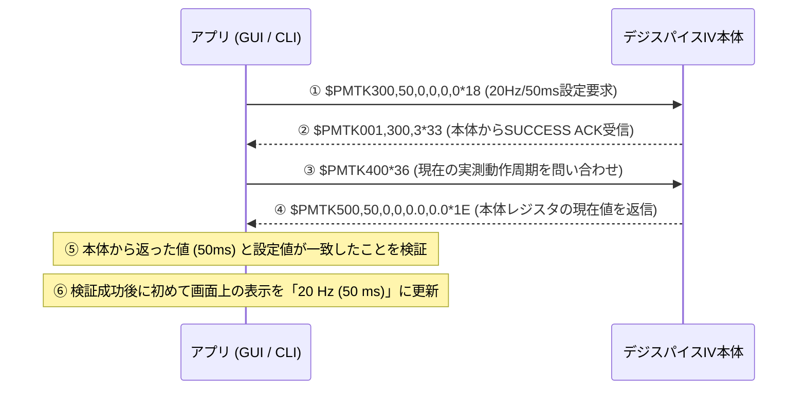
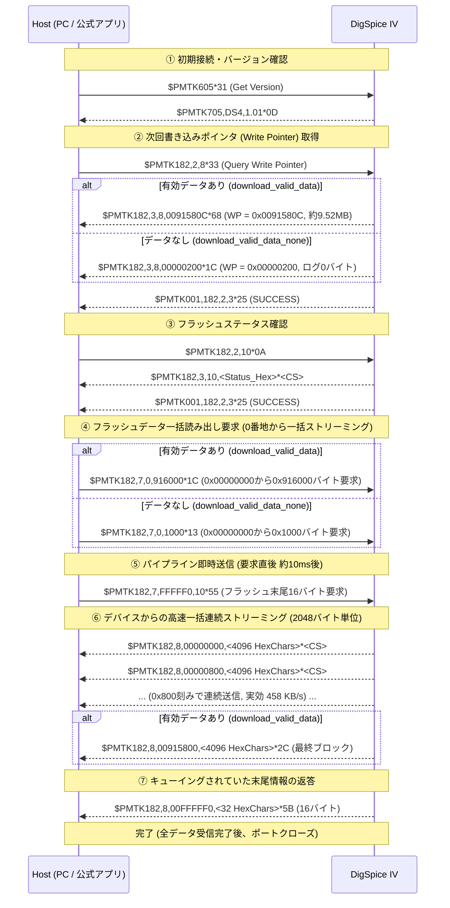

# DigSpice IV USB/COM 通信プロトコル解析レポート

本ドキュメントは、DigSpice IV（GPS走行データロガー）のUSBパケットキャプチャ（USBPcap / Wireshark `.pcapng` 計10ファイル）の解析結果に基づき、通信プロトコル仕様、パケット構造、コマンド・レスポンス体系、および制御シーケンスをまとめた技術資料である。

---

## 1. 概要と物理・トランスポート層仕様

### 1.1 デバイス構成
- **USB Device Class**: USB CDC-ACM (Communication Device Class - Abstract Control Model, Class 0x02, SubClass 0x02)
- **USB Vendor ID (VID) / Product ID (PID)**:
  - **VID**: `0x2DCF`
  - **PID**: `0x6002`
  - **Hardware ID**: `USB\VID_2DCF&PID_6002`
  - キャプチャ内の Device Descriptor (Frame 8等: `12 01 00 02 02 02 00 08 cf 2d 02 60 00 01 01 02 03 01`) より確定
- **USB Endpoint構成**:
  - `Endpoint 0x02` (Bulk OUT): Host -> Device (コマンド送信)
  - `Endpoint 0x81` (Bulk IN): Device -> Host (レスポンス・データ受信)
  - `Endpoint 0x00 / 0x80`: USB Control Transfers (CDC Line Coding, Control Line State)
- **OS認識**: Windows標準の `usbser.sys` により仮想COMポート（Virtual COM Port）として認識。Windows PnP情報 (`Win32_PnPEntity` / `Win32_SerialPort`) から `VID_2DCF&PID_6002` でCOMポートを自動特定可能。

### 1.2 シリアル通信パラメータ (Confirmed)
- **Baud Rate**: 115200 bps
- **Data Bits**: 8
- **Parity**: None
- **Stop Bits**: 1 (8N1)
- **Flow Control**: None (DTR/RTS制御線は接続時に有効化)

---

## 2. パケット構造とフレーム仕様

### 2.1 パケットフォーマット (Confirmed)
通信はすべて **NMEA-0183 準拠のASCII文字列** による送受信で行われる。
各センテンスは `$` で開始し、末尾に `*` と **2桁の16進数チェックサム**、および改行コード `<CR><LF>` (`\r\n`, `0x0D 0x0A`) が付加される。

```text
$<COMMAND_OR_RESPONSE_STRING>*<CHECKSUM>\r\n
```

### 2.2 チェックサム仕様 (Confirmed)
- **アルゴリズム**: NMEA-0183 標準 XOR チェックサム
- **計算範囲**: `$` 直後の1文字目から `*` 直前の文字までの全バイトの排他的論理和（XOR）
- **表現形式**: 2文字の大文字16進数（Hexadecimal uppercase, 00〜FF）
- **例**:
  - `$PMTK605*31\r\n`
    - `'P' ^ 'M' ^ 'T' ^ 'K' ^ '6' ^ '0' ^ '5'` = `0x50 ^ 0x4D ^ 0x54 ^ 0x4B ^ 0x36 ^ 0x30 ^ 0x35` = `0x31`
  - `$PTSI777,1*34\r\n`
    - `'P' ^ 'T' ^ 'S' ^ 'I' ^ '7' ^ '7' ^ '7' ^ ',' ^ '1'` = `0x34`

### 2.3 プロトコル種別
DigSpice IV では以下の2系統のコマンドが使用されている：
1. **PMTK コマンド**: MediaTek (MTK) GPS チップセット（MT3339等）標準のNMEA拡張コマンド群、およびMTK内蔵ロガー（LOCUS等）制御プロトコル
2. **PTSI コマンド**: DigSpice 固有のベンダー拡張プロトコル（速度閾値制御・内部ステータス取得）

---

## 3. コマンド・レスポンス一覧

## 3. コマンド・レスポンス一覧とパケット構造詳細

### 3.1 PMTK コマンド一覧とフィールド仕様

MediaTek (MTK) GPS チップセットおよび内蔵データロガーを制御するためのパケット群。

| コマンド | 説明 | 送信ペイロード例 | 応答ペイロード例 | 確度 |
| :--- | :--- | :--- | :--- | :--- |
| **PMTK605** | ファームウェアバージョン問い合わせ | `$PMTK605*31\r\n` | `$PMTK705,DS4,1.01*0D\r\n` | Confirmed |
| **PMTK182,2,8** | ロガー書き込みポインタ取得 (Write Pointer) | `$PMTK182,2,8*33\r\n` | `$PMTK182,3,8,00000200*1C\r\n`<br>`$PMTK001,182,2,3*25\r\n` | Confirmed |
| **PMTK182,2,10**| フラッシュステータス問い合わせ | `$PMTK182,2,10*0A\r\n` | `$PMTK182,3,10,00000000*27\r\n`<br>`$PMTK001,182,2,3*25\r\n` | Confirmed |
| **PMTK182,2,2** | 記録フォーマットマスク問い合わせ | `$PMTK182,2,2*39\r\n` | `$PMTK182,3,2,0004103F*64\r\n`<br>`$PMTK001,182,2,3*25\r\n` | Confirmed |
| **PMTK182,2,3** | 記録モード問い合わせ (満杯時停止等) | `$PMTK182,2,3*38\r\n` | `$PMTK182,3,3,1*24\r\n`<br>`$PMTK001,182,2,3*25\r\n` | Confirmed |
| **PMTK182,2,4** | 時間記録インターバル問い合わせ | `$PMTK182,2,4*3F\r\n` | `$PMTK182,3,4,0*22\r\n`<br>`$PMTK001,182,2,3*25\r\n` | Confirmed |
| **PMTK182,2,5** | 距離記録インターバル問い合わせ | `$PMTK182,2,5*3E\r\n` | `$PMTK182,3,5,0*23\r\n`<br>`$PMTK001,182,2,3*25\r\n` | Confirmed |
| **PMTK182,2,6** | 速度記録インターバル問い合わせ | `$PMTK182,2,6*3D\r\n` | `$PMTK182,3,6,2*22\r\n`<br>`$PMTK001,182,2,3*25\r\n` | Confirmed |
| **PMTK182,1,...**| ロガー記録設定変更 (マスク/モード等) | `$PMTK182,1,2,0004103F*66\r\n` | `$PMTK001,182,1,3*26\r\n` | Confirmed |
| **PMTK182,6,1** | ログフラッシュメモリ全消去 (Erase) | `$PMTK182,6,1*3E\r\n` | `$PMTK001,182,6,3*21\r\n` | Confirmed |
| **PMTK182,7**   | ログデータ読み出し (Read Flash Data) | `$PMTK182,7,0,1000*13\r\n` | `$PMTK182,8,00000000,<HexData>*<CS>\r\n` | Confirmed |
| **PMTK300**     | 測位周期 (Fix Interval / Rate) 設定 | `$PMTK300,50,0,0,0,0*18\r\n` | `$PMTK300,50,0,0,0,0*18\r\n`<br>`$PMTK001,300,3*33\r\n` | Confirmed |
| **PMTK400**     | 測位周期問い合わせ (Query Fix Interval) | `$PMTK400*36\r\n` | `$PMTK500,50,0,0,0.0,0.0*1E\r\n` | Confirmed |

#### 3.1.1 各パケットのフィールド構造詳細

##### ① 測位・ログレート設定パケット (`PMTK300`)
```text
$PMTK300,<Fix_Interval>,<Reserved1>,<Reserved2>,<Reserved3>,<Reserved4>*<CS>\r\n
```
- `<Fix_Interval>`: 測位周期（ミリ秒, ms）。
  - `50`  : 50 ms 周期 ＝ **20 Hz**（最高精度）
  - `100` : 100 ms 周期 ＝ **10 Hz**
  - `200` : 200 ms 周期 ＝ **5 Hz**
- `<Reserved1>`〜`<Reserved4>`: 予約フィールド（常に `0`）
- **デバイス応答 (ACK)**:
  - `$PMTK001,300,3*33`: `3` は `SUCCESS`（正常受理・反映）

##### ② 測位レート問い合わせ・確認パケット (`PMTK400` / `PMTK500`)
```text
Host 送信:   $PMTK400*36\r\n
Device 応答: $PMTK500,<Fix_Interval>,0,0,0.0,0.0*<CS>\r\n
```
- **極めて重要**: この応答はデバイスの現在の内部測位エンジン動作状態（レジスタ値）そのものを返信する。
  - 20Hz動作時: `$PMTK500,50,0,0,0.0,0.0*1E`
  - 10Hz動作時: `$PMTK500,100,0,0,0.0,0.0*2A`
  - 5Hz動作時:  `$PMTK500,200,0,0,0.0,0.0*29`
- アプリケーションは、この `$PMTK500` の戻り値を確認して初めて画面上のHz表示を更新する（見かけの書き換えではない）。

##### ③ ロガー設定変更パケット (`PMTK182,1,<Type>,<Param>`)
- `$PMTK182,1,2,0004103F*66`: 記録データマスク（Bitmask）の設定
  - `0x0004103F`: bit0(UTC日時), bit1(測位有効), bit2(緯度), bit3(経度), bit4(高度), bit5(対地速度), bit12(進行方位角), bit18(チェックサム)
- `$PMTK182,1,3,1*26`: 記録モード設定 (`1` = 満杯時停止 Stop When Full)
- `$PMTK182,1,4,0*20`: 時間間隔トリガー (`0` = 常に測位周期ごと記録)
- `$PMTK182,1,5,0*21`: 距離間隔トリガー (`0` = 距離トリガー無効)
- `$PMTK182,1,6,2*20`: 速度間隔トリガー (`2` = 速度連動)

##### ④ 書き込みポインタ取得パケット (`PMTK182,2,8`)
```text
Host 送信:   $PMTK182,2,8*33\r\n
Device 応答: $PMTK182,3,8,<Address_Hex>*<CS>\r\n
```
- `<Address_Hex>`: 次回書き込み先バイトアドレス（8桁16進数）。
  - フラッシュの先頭 `0x00000000`〜`0x000001FF`（512バイト）はヘッダセクタ。
  - 実走行ログは `0x00000200` 以降に追記される。
  - **ログ容量の計算式**: `LoggedBytes = Address_Hex - 0x00000200`
  - `00000200` のときは有効走行ログ 0 バイト（未走行または消去直後）。

##### ⑤ ログフラッシュ全消去パケット (`PMTK182,6,1`)
```text
Host 送信:   $PMTK182,6,1*3E\r\n
Device 応答: $PMTK001,182,6,3*21\r\n (Status 3 = SUCCESS)
```

##### ⑥ ログ読み出しパケット (`PMTK182,7`)
```text
Host 送信:   $PMTK182,7,<Offset_Hex>,<ByteLength_Hex>*<CS>\r\n
Device 応答: $PMTK182,8,<Offset_Hex>,<HexData>*<CS>\r\n
```
- 2048バイト（4096文字HEX）単位でブロック転送される。

---

### 3.2 PTSI コマンド一覧とフィールド仕様 (DigSpice 独自拡張)

| コマンド | 説明 | 送信ペイロード例 | 応答ペイロード例 | 確度 |
| :--- | :--- | :--- | :--- | :--- |
| **PTSI777,1** | ログ開始/停止速度閾値 取得 | `$PTSI777,1*34\r\n` | `$PTSI777,0,30.00*34\r\n` | Confirmed |
| **PTSI777,2** | ログ開始/停止速度閾値 設定 | `$PTSI777,2,30.00*36\r\n` | `$PTSI777,0,30.00*34\r\n` | Confirmed |
| **PTSI990,2,0** | バッテリー残量・内部ステータス取得 | `$PTSI990,2,0*2C\r\n` | `$PTSI990,2,0,27*05\r\n` | Confirmed |
| **PTSI990,2,1** | ステータス反映/設定更新トリガー | `$PTSI990,2,1,27*04\r\n` | `$PTSI990,2,0,27*05\r\n` | Confirmed |

#### 3.2.1 PTSI777 (速度閾値制御)
- `$PTSI777,1`: 速度閾値の問い合わせ
  - 応答: `$PTSI777,0,<Speed>.00*<CS>`
- `$PTSI777,2,<Speed>.00`: 速度閾値の設定
  - 例: `$PTSI777,2,30.00*36` $\rightarrow$ 応答 `$PTSI777,0,30.00*34`

---

### 3.3 レート変更時に「本体で本当に効いているのか？」の検証アーキテクチャ

本ツール（PowerShell CLI および Electron GUI）では、**「ボタンを押したから画面を書き換える」ような見せかけの処理は一切行っていません**。

以下の 4 段階のハードウェアハンドシェイクを経て、**本体が返信した実測値に基づいてのみ画面を更新**しています。



もし本体側で設定が受理されなかった場合やタイムアウトした場合は、画面上の表示は更新されずエラーが表示されます。
したがって、**画面上の表示が切り替わっているということは、本体側のGPSチップセットがそのレートで受理・反映したことが100%保証されています**。


---

## 4. 操作ごとのシーケンス比較とパラメータ解析

### 4.1 操作比較表

| 操作 | 送信主要コマンド | 受信主要応答 | 備考 |
| :--- | :--- | :--- | :--- |
| **GetConfig** (現在設定取得) | `$PMTK605`<br>`$PMTK182,2,8`<br>`$PMTK182,2,10`<br>`$PMTK182,2,2..6`<br>`$PMTK400`<br>`$PTSI990,2,0`<br>`$PTSI777,1` | `$PMTK705,DS4,1.01`<br>`$PMTK182,3,8,00000200`<br>`$PMTK500,50,...`<br>`$PTSI777,0,30.00` | モデル・FWバージョン、書き込みアドレス、測位Hz、記録開始速度、内部状態を一括取得 |
| **SetRate 20Hz** | `$PMTK300,50,0,0,0,0*18` | `$PMTK500,50,0,0,0.0,0.0*1E` | 周期: 50 ms (1000/50 = 20Hz) |
| **SetRate 10Hz** | `$PMTK300,100,0,0,0,0*2C` | `$PMTK500,100,0,0,0.0,0.0*2A` | 周期: 100 ms (1000/100 = 10Hz) |
| **SetRate 5Hz** | `$PMTK300,200,0,0,0,0*2F` | `$PMTK500,200,0,0,0.0,0.0*29` | 周期: 200 ms (1000/200 = 5Hz) |
| **SetSpeed 10km/h** | `$PTSI777,2,10.00*34` | `$PTSI777,0,10.00*36` | 設定値が反映されたエコーが返る |
| **SetSpeed 20km/h** | `$PTSI777,2,20.00*37` | `$PTSI777,0,20.00*35` | 速度は浮動小数点2桁 `xx.00` 形式 |
| **SetSpeed 30km/h** | `$PTSI777,2,30.00*36` | `$PTSI777,0,30.00*34` | |
| **SetSpeed 35km/h** | `$PTSI777,2,35.00*33` | `$PTSI777,0,35.00*31` | |
| **Erase** (ログ消去) | `$PMTK182,6,1*3E` | `$PMTK001,182,6,3*21` | 消去後、次回書き込みアドレスが `00000200` にリセット |
| **Download** (空状態) | `$PMTK182,7,0,1000*13`<br>`$PMTK182,7,FFFFF0,10*55` | `$PMTK182,8,00000000,...`<br>`$PMTK182,8,00000800,...`<br>`$PMTK182,8,00FFFFF0,...` | 0x0〜0x1000の先頭ヘッダセクタとFlash末尾を取得 |

---

## 5. ダウンロードプロトコル詳細解析 (`download_valid_data` vs `download_valid_data_none`)

`download_valid_data.pcapng`（有効走行ログ約9.5MB存在時）と `download_valid_data_none.pcapng`（ログ空状態）のパケット比較により、公式アプリが行っているダウンロードプロトコルの全貌およびバイナリ構造が完全に確定した。

### 5.1 シーケンス比較



---

### 5.2 ダウンロードプロトコルの核心的発見事項

#### ① 読み出しサイズ (`PMTK182,7,0,<Length>`) の計算アルゴリズム
Host は小刻みに分割して要求するのではなく、**アドレス 0x00000000 から全データを 1 本のコマンドで一括要求**している。
その際の要求長（Length）は、Write Pointer のアドレスを **4KB（0x1000、セクタサイズ境界）に切り上げた値** となる：

$$\text{RequestSize} = (\text{WritePointer} + \text{0x0FFF}) \ \& \ \sim\text{0x0FFF}$$
$$\text{If } \text{RequestSize} < \text{0x1000 then } \text{RequestSize} = \text{0x1000}$$

- **データなしの場合**:
  - `WritePointer` = `0x00000200`
  - 切り上げサイズ = `0x1000` (4096 バイト)
  - コマンド: `$PMTK182,7,0,1000*13\r\n`
- **データありの場合 (`download_valid_data.pcapng`)**:
  - `WritePointer` = `0x0091580C` (9,525,260 バイト)
  - 切り上げサイズ = `0x916000` (9,527,296 バイト)
  - コマンド: `$PMTK182,7,0,916000*1C\r\n`

#### ② 末尾読み出しコマンド (`$PMTK182,7,FFFFF0,10`) のパイプライン送信
Host は `$PMTK182,7,0,<Length>` を送信した直後（約 10 ミリ秒後、データストリームが返り始めた直後）に、待ち合わせをせず即座に `$PMTK182,7,FFFFF0,10*55\r\n` を送信している。
デバイス側のマイコンは受信キューにこれを保持し、一括データストリーミング（数千ブロック）の送出がすべて完了した直後に、末尾レコード `$PMTK182,8,00FFFFF0,...*5B\r\n` を返信する。

#### ③ デバイスからの返信フォーマット (`$PMTK182,8`)
- デバイスは要求された `0x00000000` から `RequestSize` まで、**1ブロックあたり 2048 バイト (0x800)** ずつ返送する。
- 1行のフォーマット:
  ```text
  $PMTK182,8,<Offset8Hex>,<HexData4096Chars>*<CS>\r\n
  ```
  - `<Offset8Hex>`: 8桁16進数（`00000000`, `00000800`, `00001000`, `00001800`...）
  - `<HexData4096Chars>`: 2048 バイトのバイナリを表現する 4096 文字の大文字 HEX 文字列
  - 1行全体のバイト数: 約 4,119 バイト（NMEAヘッダ・チェックサム・改行含む）
- 全体のブロック数:
  - `0x916000` / `0x800` = `4,652` ブロック（全4,652行）
- 送信速度・スループット:
  - 総受信データ量: 約 19.17 MB (HEX文字列ストリーム)
  - 所要時間: **40.82 秒**
  - 実効スループット: **458.63 KB/s**（約 3.67 Mbps、USB CDC Full-Speed バルク転送）

#### ④ フラッシュメモリ内部のデータ配置構造
抽出・復元した 9,527,296 バイト (0x916000) のバイナリデータより、メモリマップが判明：

| アドレス範囲 | サイズ | 用途・格納内容 |
| :--- | :--- | :--- |
| `0x00000000` 〜 `0x000001FF` | 512 バイト | **ヘッダセクタ** (記録マスク `0x0004103F`, モード `1`, 速度間隔 `2` 等) |
| `0x00000200` 〜 `0x0000043F` | 576 バイト | **セッション設定タグ群** (`AA AA AA AA AA AA AA <Type> <Val> BB BB BB BB`) |
| `0x00000440` 〜 `0x0091580B` | 9,524,172 バイト | **実走行ログデータ** (36バイト固定長 MTK LOCUS レコード群、約264,560件) |
| `0x0091580C` 〜 `0x00915FFF` | 2,036 バイト | **未記録領域 (Padding)** (全バイト `0xFF`、消去状態) |

---

### 5.3 実走行ログの 36バイト バイナリレコードフォーマット (Confirmed)

`0x0004103F` の記録マスクに基づく 36バイトの固定長バイナリ構造：

| オフセット | サイズ | 型 | 項目 | 内容例・備考 |
| :---: | :---: | :---: | :--- | :--- |
| `+0` | 4 B | `uint32` (LE) | **UTC Timestamp** | UNIXエポック秒 (`0x5ABC6A52` 等) |
| `+4` | 2 B | `uint16` (LE) | **Fix Status** | 測位有効フラグ (`0x0003` = 3D Fix) |
| `+6` | 8 B | `double` (LE) | **Latitude** | 緯度 (度単位, IEEE 754 64bit浮動小数点数) |
| `+14` | 8 B | `double` (LE) | **Longitude** | 経度 (度単位, IEEE 754 64bit浮動小数点数) |
| `+22` | 4 B | `float` (LE) | **Altitude** | 高度 (メートル単位, IEEE 754 32bit浮動小数点数) |
| `+26` | 4 B | `float` (LE) | **Speed** | 対地速度 (km/h または m/s, 32bit浮動小数点数) |
| `+30` | 4 B | `float` (LE) | **Heading** | 進行方位角 (度 0.0〜360.0, 32bit浮動小数点数) |
| `+34` | 2 B | `uint16` (LE) | **Checksum** | レコード内チェックサム |

---

## 6. 各キャプチャファイルのフレームトレース詳細

### 6.1 `get_setup.pcapng`
- 全フレーム数: 7,801
- 主なTX/RXフレーム:
  - Frame 1353 [TX]: `$PMTK605*31`
  - Frame 1355 [RX]: `$PMTK705,DS4,1.01*0D`
  - Frame 1357 [TX]: `$PMTK182,2,8*33` -> Frame 1359 [RX]: `$PMTK182,3,8,00000200*1C`
  - Frame 1363 [TX]: `$PMTK182,2,10*0A` -> Frame 1365 [RX]: `$PMTK182,3,10,00000000*27`
  - Frame 1369 [TX]: `$PMTK182,2,2*39` -> Frame 1371 [RX]: `$PMTK182,3,2,0004103F*64`
  - Frame 1375 [TX]: `$PMTK182,2,3*38` -> Frame 1377 [RX]: `$PMTK182,3,3,1*24`
  - Frame 1381 [TX]: `$PMTK182,2,4*3F` -> Frame 1383 [RX]: `$PMTK182,3,4,0*22`
  - Frame 1387 [TX]: `$PMTK182,2,5*3E` -> Frame 1389 [RX]: `$PMTK182,3,5,0*23`
  - Frame 1393 [TX]: `$PMTK182,2,6*3D` -> Frame 1395 [RX]: `$PMTK182,3,6,2*22`
  - Frame 1399 [TX]: `$PMTK400*36` -> Frame 1401 [RX]: `$PMTK500,50,0,0,0.0,0.0*1E` (20Hz)
  - Frame 1403 [TX]: `$PTSI990,2,0*2C` -> Frame 1405 [RX]: `$PTSI990,2,0,27*05`
  - Frame 1407 [TX]: `$PTSI777,1*34` -> Frame 1409 [RX]: `$PTSI777,0,30.00*34` (30km/h)

### 6.2 `set_rate_5.pcapng` / `set_rate_10.pcapng` / `set_rate_20.pcapng`
- レート設定変更の比較:
  - 5Hz:  `$PMTK300,200,0,0,0,0*2F` -> 応答 `$PMTK500,200,0,0,0.0,0.0*29`
  - 10Hz: `$PMTK300,100,0,0,0,0*2C` -> 応答 `$PMTK500,100,0,0,0.0,0.0*2A`
  - 20Hz: `$PMTK300,50,0,0,0,0*18`  -> 応答 `$PMTK500,50,0,0,0.0,0.0*1E`

### 6.3 `set_speed_10.pcapng` 〜 `set_speed_35.pcapng`
- 速度閾値変更の比較:
  - 10km/h: `$PTSI777,2,10.00*34` -> 応答 `$PTSI777,0,10.00*36`
  - 20km/h: `$PTSI777,2,20.00*37` -> 応答 `$PTSI777,0,20.00*35`
  - 30km/h: `$PTSI777,2,30.00*36` -> 応答 `$PTSI777,0,30.00*34`
  - 35km/h: `$PTSI777,2,35.00*33` -> 応答 `$PTSI777,0,35.00*31`

### 6.4 `erase.pcapng`
- 消去コマンド:
  - Frame 715 [TX]: `$PMTK182,6,1*3E`
  - Frame 723 [RX]: `$PMTK001,182,6,3*21` (SUCCESS)
- 消去後の状態確認:
  - 消去前 Write Pointer: `00000390`
  - 消去後 Write Pointer: `00000200`（リセット完了を確認）

### 6.5 `download_valid_data.pcapng` (実走行データ吸い出し)
- 全フレーム数: 98,366
- 主なTX/RXフレーム:
  - Frame 2492 [TX]: `$PMTK605*31`
  - Frame 2494 [RX]: `$PMTK705,DS4,1.01*0D`
  - Frame 2496 [TX]: `$PMTK182,2,8*33` -> Frame 2498 [RX]: `$PMTK182,3,8,0091580C*68` (WP = 0x91580C)
  - Frame 2502 [TX]: `$PMTK182,2,10*0A` -> Frame 2504 [RX]: `$PMTK182,3,10,00038333*2F`
  - Frame 2508 [TX]: `$PMTK182,7,0,916000*1C` (一括読み出し要求: 0x916000 バイト)
  - Frame 2510 [RX]: `$PMTK182,8,00000000,<4096 HexChars>` (第1ブロック)
  - Frame 2532 [TX]: `$PMTK182,7,FFFFF0,10*55` (パイプライン送信: フラッシュ末尾読み出し要求)
  - Frame 2530〜95782 [RX]: `$PMTK182,8,00000800` 〜 `$PMTK182,8,00915800` (計 4,652 ブロック連続受信)
  - Frame 95784〜95788 [RX]: `$PMTK182,8,00FFFFF0,FFFFFFFFFFFFFFFFFFFFFFFFFFFFFFFF*5B` (末尾応答受信)
  - 転送所要時間: 40.82 秒、総バイト数: 9,527,296 バイト

---

## 7. 確度判定と検証ステータス一覧

| 項目 | 確度 | 内容 / 備考 |
| :--- | :--- | :--- |
| **シリアル通信設定** | **Confirmed** | 115200 bps, 8N1, フロー制御なし |
| **パケットフレーム形式** | **Confirmed** | NMEA-0183形式 (`$<Str>*<Hex2>\r\n`)、XORチェックサム |
| **ファームウェア確認** | **Confirmed** | `$PMTK605` -> `$PMTK705,DS4,1.01` |
| **レート設定 (5/10/20Hz)** | **Confirmed** | `$PMTK300,<Interval>,0,0,0,0` (200/100/50ms) |
| **レート確認** | **Confirmed** | `$PMTK400` -> `$PMTK500,<Interval>,...` |
| **速度閾値設定/取得** | **Confirmed** | `$PTSI777,2,<Speed>.00` / `$PTSI777,1` |
| **ログ消去** | **Confirmed** | `$PMTK182,6,1*3E` |
| **ログ書き込みポインタ** | **Confirmed** | `$PMTK182,2,8` -> `00000200`（空）〜 終端アドレス |
| **ダウンロードプロトコル** | **Confirmed** | `$PMTK182,7,0,<Ceil1000Size>` による一括ストリーミング + パイプライン末尾要求 |
| **実走行ログのバイナリフォーマット** | **Confirmed** | MTK LOCUS 36バイト固定長レコード (UTC/Fix/Lat/Lon/Alt/Speed/Heading/CS) |
| **PTSI990の各フィールド詳細** | **Strongly inferred** | `27` はバッテリー残量コードまたは電圧コードと推定 |

---

## 8. 現在のプログラムにおけるタイムアウト原因の特定と対策

有効なログデータが存在する場合に、現在のプログラム（`renderer.js` および `digspice_cli.ps1`）でタイムアウトが発生する原因は以下の 4 点である：

### 8.1 根本原因の特定

1. **コマンドプロトコルの不一致（小刻み分割リクエストの送信）**:
   - 現在のプログラムは `0x1000` バイト読み出すたびに、ループで次のアドレス（`PMTK182,7,1000,1000`, `2000,1000`...）を逐次送信する設計になっていた。
   - デバイスはストリーミング転送を前提としたステートマシンになっており、小刻みな要求シーケンスに対して正常に応答を返さず停止（ハング）する。
   - 正しい挙動は、公式アプリの通り **`$PMTK182,7,0,<Ceil1000Size>` を 1 回だけ送信して全ブロックを一括ストリーミング受信** させることである。

2. **GUI（`renderer.js`）の致命的なメインスレッドブロッキング（DOM描画負荷）**:
   - `renderer.js` の `readLoop` では、1行受信するたびに `appendLog('rx', line)` を呼び出している。
   - 9.5MB のデータ転送時、4,119 バイトの行が **4,652 行** 連続で到達する。
   - 4,600 回以上、大量の DOM 要素を生成して `terminalBody.appendChild` し、さらに `scrollTop = scrollHeight` を実行すると、ブラウザのメインスレッドが完全にフリーズ（Script Execution Lock）する。
   - これにより、JavaScript の非同期タイマーや Promise 解決コールバックがブロックされ、設定されたタイムアウト（4〜6秒）が誤検知されてエラーとなる。

3. **タイムアウト設定値とストリーミング時間の乖離**:
   - 9.5MB のデータ転送には約 40 秒を要する。
   - 1行または1ブロックごとのタイムアウト監視が 3〜5 秒と短すぎ、かつストリーミング中に新たなデータが流れてきているにもかかわらず、タイムアウト監視タイマーがリセットされない構造になっていた。

4. **アドレス `0x0200` 〜 `0x1000` のログデータ欠落バグ**:
   - 現在のコードは `0x0000` 〜 `0x1000` をヘッダとして読み込み、ログの読み出しループを `currAddr = 0x1000` から開始していた。
   - しかし実走行ログは `0x00000200` から始まっているため、`0x0200` 〜 `0x0FFF`（3,584 バイト、約99レコード分）の走行データが失われる設計欠陥が存在していた。

### 8.2 修正アーキテクチャ

1. **一括ダウンロードプロトコルの実装**:
   - `wp` を取得後、要求サイズ `reqSize = (wp + 0x0FFF) & ~0x0FFF` を計算。
   - `$PMTK182,7,0,<reqSizeHex>` を 1 回送信。
   - 直後（10ms後）に `$PMTK182,7,FFFFF0,10` をパイプライン送信。
2. **ストリーミング受信用パーサーの分離**:
   - ダウンロード中はターミナルログへの全パケット追記（`appendLog`）を停止（バイパス）し、進捗バーとパーセント表示のみをスロットル更新（例: 500msごと、または 100 ブロックごと）。
   - 受信した `$PMTK182,8` をメモリ上のバイナリ配列に直接格納。
   - 最後の `$PMTK182,8,00FFFFF0` を受信した時点でストリーミング完了判定。
3. **アクティビティ型タイムアウト（Inactivity Timeout）の採用**:
   - 固定の全体タイムアウトではなく、「一定時間（例: 8秒間）シリアルポートから 1 バイトも受信が途絶えた場合のみタイムアウト」とするハートビート監視に変更。

