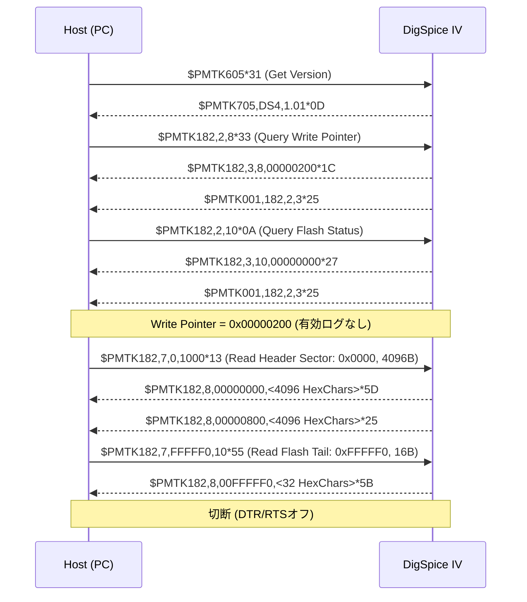

# DigSpice IV USB/COM 通信プロトコル解析レポート

本ドキュメントは、DigSpice IV（GPS走行データロガー）のUSBパケットキャプチャ（USBPcap / Wireshark `.pcapng` 計10ファイル）の解析結果に基づき、通信プロトコル仕様、パケット構造、コマンド・レスポンス体系、および制御シーケンスをまとめた技術資料である。

---

## 1. 概要と物理・トランスポート層仕様

### 1.1 デバイス構成
- **USB Device Class**: USB CDC-ACM (Communication Device Class - Abstract Control Model, Class 0x02, SubClass 0x02)
- **USB Vendor ID (VID) / Product ID (PID)**:
  - **VID**: `0x2DCF`
  - **PID**: `0x6002`
  - **Hardware ID**: `USB\VID_2DCF&PID_6002`
  - キャプチャ内の Device Descriptor (Frame 8等: `12 01 00 02 02 02 00 08 cf 2d 02 60 00 01 01 02 03 01`) より確定
- **USB Endpoint構成**:
  - `Endpoint 0x02` (Bulk OUT): Host -> Device (コマンド送信)
  - `Endpoint 0x81` (Bulk IN): Device -> Host (レスポンス・データ受信)
  - `Endpoint 0x00 / 0x80`: USB Control Transfers (CDC Line Coding, Control Line State)
- **OS認識**: Windows標準の `usbser.sys` により仮想COMポート（Virtual COM Port）として認識。Windows PnP情報 (`Win32_PnPEntity` / `Win32_SerialPort`) から `VID_2DCF&PID_6002` でCOMポートを自動特定可能。

### 1.2 シリアル通信パラメータ (Confirmed)
- **Baud Rate**: 115200 bps
- **Data Bits**: 8
- **Parity**: None
- **Stop Bits**: 1 (8N1)
- **Flow Control**: None (DTR/RTS制御線は接続時に有効化)

---

## 2. パケット構造とフレーム仕様

### 2.1 パケットフォーマット (Confirmed)
通信はすべて **NMEA-0183 準拠のASCII文字列** による送受信で行われる。
各センテンスは `$` で開始し、末尾に `*` と **2桁の16進数チェックサム**、および改行コード `<CR><LF>` (`\r\n`, `0x0D 0x0A`) が付加される。

```text
$<COMMAND_OR_RESPONSE_STRING>*<CHECKSUM>\r\n
```

### 2.2 チェックサム仕様 (Confirmed)
- **アルゴリズム**: NMEA-0183 標準 XOR チェックサム
- **計算範囲**: `$` 直後の1文字目から `*` 直前の文字までの全バイトの排他的論理和（XOR）
- **表現形式**: 2文字の大文字16進数（Hexadecimal uppercase, 00〜FF）
- **例**:
  - `$PMTK605*31\r\n`
    - `'P' ^ 'M' ^ 'T' ^ 'K' ^ '6' ^ '0' ^ '5'` = `0x50 ^ 0x4D ^ 0x54 ^ 0x4B ^ 0x36 ^ 0x30 ^ 0x35` = `0x31`
  - `$PTSI777,1*34\r\n`
    - `'P' ^ 'T' ^ 'S' ^ 'I' ^ '7' ^ '7' ^ '7' ^ ',' ^ '1'` = `0x34`

### 2.3 プロトコル種別
DigSpice IV では以下の2系統のコマンドが使用されている：
1. **PMTK コマンド**: MediaTek (MTK) GPS チップセット（MT3339等）標準のNMEA拡張コマンド群、およびMTK内蔵ロガー（LOCUS等）制御プロトコル
2. **PTSI コマンド**: DigSpice 固有のベンダー拡張プロトコル（速度閾値制御・内部ステータス取得）

---

## 3. コマンド・レスポンス一覧

### 3.1 PMTK コマンド一覧

| コマンド | 説明 | 送信ペイロード例 | 応答ペイロード例 | 確度 |
| :--- | :--- | :--- | :--- | :--- |
| **PMTK605** | ファームウェアバージョン問い合わせ | `$PMTK605*31\r\n` | `$PMTK705,DS4,1.01*0D\r\n` | Confirmed |
| **PMTK182,2,8** | ロガー書き込みポインタ取得 (Write Pointer) | `$PMTK182,2,8*33\r\n` | `$PMTK182,3,8,00000200*1C\r\n`<br>`$PMTK001,182,2,3*25\r\n` | Confirmed |
| **PMTK182,2,10**| フラッシュステータス問い合わせ | `$PMTK182,2,10*0A\r\n` | `$PMTK182,3,10,00000000*27\r\n`<br>`$PMTK001,182,2,3*25\r\n` | Confirmed |
| **PMTK182,2,2** | 記録フォーマットマスク問い合わせ | `$PMTK182,2,2*39\r\n` | `$PMTK182,3,2,0004103F*64\r\n`<br>`$PMTK001,182,2,3*25\r\n` | Confirmed |
| **PMTK182,2,3** | 記録モード問い合わせ (満杯時停止等) | `$PMTK182,2,3*38\r\n` | `$PMTK182,3,3,1*24\r\n`<br>`$PMTK001,182,2,3*25\r\n` | Confirmed |
| **PMTK182,2,4** | 時間記録インターバル問い合わせ | `$PMTK182,2,4*3F\r\n` | `$PMTK182,3,4,0*22\r\n`<br>`$PMTK001,182,2,3*25\r\n` | Confirmed |
| **PMTK182,2,5** | 距離記録インターバル問い合わせ | `$PMTK182,2,5*3E\r\n` | `$PMTK182,3,5,0*23\r\n`<br>`$PMTK001,182,2,3*25\r\n` | Confirmed |
| **PMTK182,2,6** | 速度記録インターバル問い合わせ | `$PMTK182,2,6*3D\r\n` | `$PMTK182,3,6,2*22\r\n`<br>`$PMTK001,182,2,3*25\r\n` | Confirmed |
| **PMTK182,1,...**| ロガー記録設定変更 (マスク/モード等) | `$PMTK182,1,2,0004103F*66\r\n` | `$PMTK001,182,1,3*26\r\n` | Confirmed |
| **PMTK182,6,1** | ログフラッシュメモリ全消去 (Erase) | `$PMTK182,6,1*3E\r\n` | `$PMTK001,182,6,3*21\r\n` | Confirmed |
| **PMTK182,7**   | ログデータ読み出し (Read Flash Data) | `$PMTK182,7,0,1000*13\r\n` | `$PMTK182,8,00000000,<HexData>*<CS>\r\n` | Confirmed |
| **PMTK300**     | 測位周期 (Fix Interval / Rate) 設定 | `$PMTK300,50,0,0,0,0*18\r\n` | `$PMTK300,50,0,0,0,0*18\r\n`<br>`$PMTK001,300,3*33\r\n` | Confirmed |
| **PMTK400**     | 測位周期問い合わせ | `$PMTK400*36\r\n` | `$PMTK500,50,0,0,0.0,0.0*1E\r\n` | Confirmed |

> [!NOTE]
> `$PMTK001,<Cmd>,<Status>*<CS>` は PMTK 標準のコマンド実行応答 (ACK) である。
> 第3パラメータ `3` は `SUCCESS`（成功）を意味する。

---

### 3.2 PTSI コマンド一覧 (DigSpice 独自拡張)

| コマンド | 説明 | 送信ペイロード例 | 応答ペイロード例 | 確度 |
| :--- | :--- | :--- | :--- | :--- |
| **PTSI777,1** | ログ開始/停止速度閾値 取得 | `$PTSI777,1*34\r\n` | `$PTSI777,0,30.00*34\r\n` | Confirmed |
| **PTSI777,2** | ログ開始/停止速度閾値 設定 | `$PTSI777,2,30.00*36\r\n` | `$PTSI777,0,30.00*34\r\n` | Confirmed |
| **PTSI990,2,0** | バッテリー残量・内部ステータス取得 | `$PTSI990,2,0*2C\r\n` | `$PTSI990,2,0,27*05\r\n` | Confirmed |
| **PTSI990,2,1** | ステータス反映/設定更新トリガー | `$PTSI990,2,1,27*04\r\n` | `$PTSI990,2,0,27*05\r\n` | Confirmed |

---

## 4. 操作ごとのシーケンス比較とパラメータ解析

### 4.1 操作比較表

| 操作 | 送信主要コマンド | 受信主要応答 | 備考 |
| :--- | :--- | :--- | :--- |
| **GetConfig** (現在設定取得) | `$PMTK605`<br>`$PMTK182,2,8`<br>`$PMTK182,2,10`<br>`$PMTK182,2,2..6`<br>`$PMTK400`<br>`$PTSI990,2,0`<br>`$PTSI777,1` | `$PMTK705,DS4,1.01`<br>`$PMTK182,3,8,00000200`<br>`$PMTK500,50,...`<br>`$PTSI777,0,30.00` | モデル・FWバージョン、書き込みアドレス、測位Hz、記録開始速度、内部状態を一括取得 |
| **SetRate 20Hz** | `$PMTK300,50,0,0,0,0*18` | `$PMTK500,50,0,0,0.0,0.0*1E` | 周期: 50 ms (1000/50 = 20Hz) |
| **SetRate 10Hz** | `$PMTK300,100,0,0,0,0*2C` | `$PMTK500,100,0,0,0.0,0.0*2A` | 周期: 100 ms (1000/100 = 10Hz) |
| **SetRate 5Hz** | `$PMTK300,200,0,0,0,0*2F` | `$PMTK500,200,0,0,0.0,0.0*29` | 周期: 200 ms (1000/200 = 5Hz) |
| **SetSpeed 10km/h** | `$PTSI777,2,10.00*34` | `$PTSI777,0,10.00*36` | 設定値が反映されたエコーが返る |
| **SetSpeed 20km/h** | `$PTSI777,2,20.00*37` | `$PTSI777,0,20.00*35` | 速度は浮動小数点2桁 `xx.00` 形式 |
| **SetSpeed 30km/h** | `$PTSI777,2,30.00*36` | `$PTSI777,0,30.00*34` | |
| **SetSpeed 35km/h** | `$PTSI777,2,35.00*33` | `$PTSI777,0,35.00*31` | |
| **Erase** (ログ消去) | `$PMTK182,6,1*3E` | `$PMTK001,182,6,3*21` | 消去後、次回書き込みアドレスが `00000200` にリセット |
| **Download** (空状態) | `$PMTK182,7,0,1000*13`<br>`$PMTK182,7,FFFFF0,10*55` | `$PMTK182,8,00000000,...`<br>`$PMTK182,8,00000800,...`<br>`$PMTK182,8,00FFFFF0,...` | 0x0〜0x1000の先頭ヘッダセクタとFlash末尾を取得 |

---

## 5. `download_valid_data_none.pcapng` の詳細解析

本キャプチャは「本体側に有効ログデータが存在しない状態でダウンロード操作を行った場合」の挙動である。



### 重点検証結果

1. **Hostから送られるdownload開始コマンド**:
   - まず `$PMTK182,2,8*33` により、フラッシュメモリの次回書き込み先アドレス（Log Write Pointer）を取得する。
   - 続いて `$PMTK182,7,0,1000*13` により、先頭アドレス `0x00000000` から `0x1000`（4096バイト）を読み出す。
2. **Deviceからの初期応答**:
   - `$PMTK182,3,8,00000200*1C` が返る。
   - フラッシュの先頭 `0x00000000` 〜 `0x000001FF`（512バイト）はヘッダ領域であり、実ログデータは `0x00000200` 以降に追記される。
3. **保存データ数 / サイズ / empty状態を示すフィールド**:
   - **判定式**: `有効データ長 (bytes) = WritePointer - 0x00000200`
   - 消去直後またはログ未記録状態では `WritePointer == 0x00000200` となり、有効データ長は `0`（empty状態）と判定できる。
4. **「データ無し」を示すステータスコード**:
   - 明示的なエラーコードではなく、`WritePointer` の値がヘッダ直後（`00000200`）を指していることによって公式アプリはデータなしと判定している。
5. **Host側の再試行有無**:
   - 再試行は行われず、ヘッダセクタ（0x0000〜0x1000）および末尾情報（0xFFFFF0）を取得した直後に正常終了（ポートクローズ）している。
6. **転送終了コマンド / ACK有無**:
   - 読み出しデータ `$PMTK182,8,...` は要求長に達した時点で自動完了し、明示的な終了コマンドは送信されない。

### ヘッダセクタのデータ構造 (先頭32バイト)
`download_valid_data_none` から抽出したヘッダセクタ（0x0000番地）のバイナリデコード結果：
```text
ff ff 3f 10 04 00 02 00 01 00 00 00 00 00 00 00 00 00 00 00 ff ff ...
```
- `3f 10 04 00` (リトルエンディアン `0x0004103F`): 記録項目マスク（Bitmask）
- `02 00`: 速度間隔設定値 (`2`)
- `01 00`: 記録モード (`1`)

---

## 6. 各キャプチャファイルのフレームトレース詳細

### 6.1 `get_setup.pcapng`
- 全フレーム数: 7,801
- 主なTX/RXフレーム:
  - Frame 1353 [TX]: `$PMTK605*31`
  - Frame 1355 [RX]: `$PMTK705,DS4,1.01*0D`
  - Frame 1357 [TX]: `$PMTK182,2,8*33` -> Frame 1359 [RX]: `$PMTK182,3,8,00000200*1C`
  - Frame 1363 [TX]: `$PMTK182,2,10*0A` -> Frame 1365 [RX]: `$PMTK182,3,10,00000000*27`
  - Frame 1369 [TX]: `$PMTK182,2,2*39` -> Frame 1371 [RX]: `$PMTK182,3,2,0004103F*64`
  - Frame 1375 [TX]: `$PMTK182,2,3*38` -> Frame 1377 [RX]: `$PMTK182,3,3,1*24`
  - Frame 1381 [TX]: `$PMTK182,2,4*3F` -> Frame 1383 [RX]: `$PMTK182,3,4,0*22`
  - Frame 1387 [TX]: `$PMTK182,2,5*3E` -> Frame 1389 [RX]: `$PMTK182,3,5,0*23`
  - Frame 1393 [TX]: `$PMTK182,2,6*3D` -> Frame 1395 [RX]: `$PMTK182,3,6,2*22`
  - Frame 1399 [TX]: `$PMTK400*36` -> Frame 1401 [RX]: `$PMTK500,50,0,0,0.0,0.0*1E` (20Hz)
  - Frame 1403 [TX]: `$PTSI990,2,0*2C` -> Frame 1405 [RX]: `$PTSI990,2,0,27*05`
  - Frame 1407 [TX]: `$PTSI777,1*34` -> Frame 1409 [RX]: `$PTSI777,0,30.00*34` (30km/h)

### 6.2 `set_rate_5.pcapng` / `set_rate_10.pcapng` / `set_rate_20.pcapng`
- レート設定変更の比較:
  - 5Hz:  `$PMTK300,200,0,0,0,0*2F` -> 応答 `$PMTK500,200,0,0,0.0,0.0*29`
  - 10Hz: `$PMTK300,100,0,0,0,0*2C` -> 応答 `$PMTK500,100,0,0,0.0,0.0*2A`
  - 20Hz: `$PMTK300,50,0,0,0,0*18`  -> 応答 `$PMTK500,50,0,0,0.0,0.0*1E`

### 6.3 `set_speed_10.pcapng` 〜 `set_speed_35.pcapng`
- 速度閾値変更の比較:
  - 10km/h: `$PTSI777,2,10.00*34` -> 応答 `$PTSI777,0,10.00*36`
  - 20km/h: `$PTSI777,2,20.00*37` -> 応答 `$PTSI777,0,20.00*35`
  - 30km/h: `$PTSI777,2,30.00*36` -> 応答 `$PTSI777,0,30.00*34`
  - 35km/h: `$PTSI777,2,35.00*33` -> 応答 `$PTSI777,0,35.00*31`

### 6.4 `erase.pcapng`
- 消去コマンド:
  - Frame 715 [TX]: `$PMTK182,6,1*3E`
  - Frame 723 [RX]: `$PMTK001,182,6,3*21` (SUCCESS)
- 消去後の状態確認:
  - 消去前 Write Pointer: `00000390`
  - 消去後 Write Pointer: `00000200`（リセット完了を確認）

---

## 7. 確度判定と未解明事項

| 項目 | 確度 | 内容 / 備考 |
| :--- | :--- | :--- |
| **シリアル通信設定** | **Confirmed** | 115200 bps, 8N1, フロー制御なし |
| **パケットフレーム形式** | **Confirmed** | NMEA-0183形式 (`$<Str>*<Hex2>\r\n`)、XORチェックサム |
| **ファームウェア確認** | **Confirmed** | `$PMTK605` -> `$PMTK705,DS4,1.01` |
| **レート設定 (5/10/20Hz)** | **Confirmed** | `$PMTK300,<Interval>,0,0,0,0` (200/100/50ms) |
| **レート確認** | **Confirmed** | `$PMTK400` -> `$PMTK500,<Interval>,...` |
| **速度閾値設定/取得** | **Confirmed** | `$PTSI777,2,<Speed>.00` / `$PTSI777,1` |
| **ログ消去** | **Confirmed** | `$PMTK182,6,1*3E` |
| **ログ書き込みポインタ** | **Confirmed** | `$PMTK182,2,8` -> `00000200`（空）〜 終端アドレス |
| **ダウンロードプロトコル** | **Confirmed** | `$PMTK182,7,<Offset>,<Len>` -> `$PMTK182,8,<Offset>,<HexData>` |
| **PTSI990の各フィールド詳細** | **Strongly inferred** | `27` はバッテリー残量(%)または電圧コードと推定されるが、他値のキャプチャがないため確定には至らない |
| **実走行ログのバイナリフォーマット** | **Unknown** | 今回のキャプチャはデータなし (`empty`) のため、各レコードの詳細構造（NMEA変換・.bnx4解析）は実ログ取得後に検証予定 |
